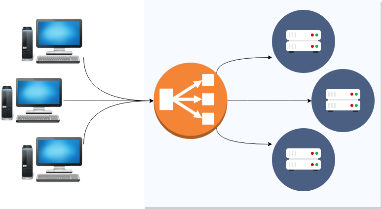
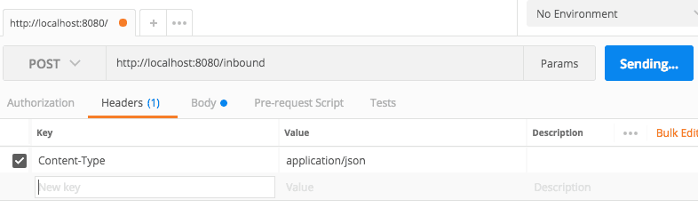
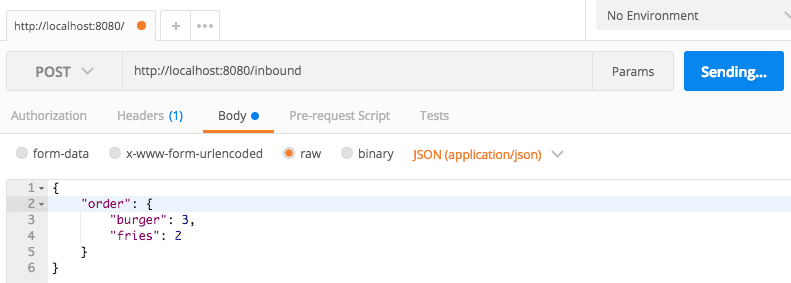

import { Head, Appear, Image } from "mdx-deck";
import { Invert, Split } from "mdx-deck/layouts";

export { default as theme } from "../../theme";

<Head>
  <title>Node.js</title>
</Head>

# Node.js

## Week 6

---

### Which version of node is installed?

```sh
$ node -v
```

---

## Node REPL

**R**ead **E**valuate **P**rint **L**oop

```sh
$ node
>
```

---

## Creating a web server

```js
const http = require("http");

//create a server object
http
  .createServer(function(req, res) {
    res.write("Hello World!"); // write a response to the client
    res.end(); // end the response
  })
  .listen(8080);
```

---

## Running files in node

```sh
$ node index.js
```

---

export default Invert;

<Split>
  <React.Fragment>
    <Appear>
      <h2>
        <code>http://localhost:8080</code>
        <br />
        <br />
      </h2>
      <h2>
        <code>http://127.0.0.1:8080</code>
      </h2>
    </Appear>
    <Appear>
      <h2>
        Domain name
        <br />
        <br />
      </h2>
      <h2>IP Address</h2>
    </Appear>
  </React.Fragment>
</Split>

---

## Debugging files in node

```sh
$ node --inspect index.js
```

```
Debugger listening on ws://127.0.0.1:9229/…
```

---

## Breaking it down

```js
const http = require("http");

http.createServer(/* ??? */);
```

---

## Breaking it down

```js
const http = require("http");

http.createServer(function(request, response) {});
```

---

## Breaking it down

```js
const http = require("http");

http.createServer(function(req, res) {
  res.write("Hello World! 🤯");
  res.end();
});
```

---

## Breaking it down

```js
const http = require("http");

http
  .createServer(function(req, res) {
    res.write("Hello World! 🤯");
    res.end();
  })
  .listen(8080);
```

---

export default Invert;

`http://localhost:80`

vs

`http://localhost:8080`

---

export default Invert;

# `sudo` 🧙

```sh
$ sudo node index.js
```

<Appear>
  <h1>
    <strong>
      DO <u>NOT</u> DO THIS IN PRODUCTION
    </strong>
  </h1>
</Appear>

---

export default Invert;


---

# Node.js

<Appear>
  <p>Single-threaded</p>
  <p>Can only do one thing at once</p>
  <p>Handles a limited number of users at once</p>
</Appear>

---

export default Invert;

# Reverse Proxy

<Appear>
  <p>
    Acts as <strong>gateway</strong>
  </p>
  <p>Sits in front of one (or more) node.js instances</p>
  <p>Handles heavy lifting of encryption, compression, queueing, …</p>
</Appear>

---

export default Invert;

# Reverse Proxy



---

# Recap

---

- Basics of using node.js
- Setting up a basic web server
- `sudo`
- Reverse proxies

---

<Image src="assets/coffee-break.jpg" />

---

# Express.js

---

# Setup

In a new project:

```sh
$ npm init
$ npm install --save express
```

---

# Basic Example

In index.js:

```js
const express = require("express");
```

---

```js
const express = require("express");
const app = express();
```

---

```js
const express = require("express");
const app = express();

app.listen(8080, function() {
  console.log("Listening on port 8080!");
});
```

---

```js
const express = require("express");
const app = express();

app.get("/", function(req, res) {});

app.listen(8080, function() {
  console.log("Listening on port 8080!");
});
```

---

```js
const express = require("express");
const app = express();

app.get("/", function(req, res) {
  res.send("Hello World!");
});

app.listen(8080, function() {
  console.log("Listening on port 8080!");
});
```

---

# How is that better?

---

export default Split;

```js
const http = require("http");

http
  .createServer(function(req, res) {
    res.write("Hello World! 🤯");
    res.end();
  })
  .listen(8080);
```

```js
const express = require("express");
const app = express();

app.get("/", function(req, res) {
  res.send("Hello World!");
});

app.listen(8080, function() {
  console.log("Listening on port 8080!");
});
```

---

export default Invert;

# Paths in URLs

<pre>
  <span style={{ color: "gray" }}>http://www.constructorlabs.com</span>
  <strong>/course</strong>
</pre>

<pre>
  <span style={{ color: "gray" }}>https://swapi.co</span>
  <strong>/api/people/1/</strong>
</pre>

---

export default Split;

```js
const http = require("http");

http
  .createServer(function(req, res) {
    if (req.path === "/") {
      res.write("Hello World!");
    } else if (req.path === "/course") {
      res.write("TODO: Course information");
    }
    res.end();
  })
  .listen(8080);
```

```js
const express = require("express");
const app = express();

app.get("/", function(req, res) {
  res.send("Hello World!");
});

app.get("/course", function(req, res) {
  res.send("TODO: Course information");
});

app.listen(8080, function() {
  console.log("Listening on port 8080!");
});
```

---

export default Split;

```js
const http = require("http");

http
  .createServer(function(req, res) {
    if (req.path === "/") {
      res.write("Hello World!");
    } else if (req.path === "/course") {
      res.write("TODO: Course information");
    } else if (req.path.startsWith("/api/people/")) {
      const personId = req.path.split("/")[3];
      return res.write(`Information about person ${personId}`);
    }
    res.end();
  })
  .listen(8080);
```

```js
const express = require("express");
const app = express();

app.get("/", function(req, res) {
  res.send("Hello World!");
});

app.get("/course", function(req, res) {
  res.send("TODO: Course information");
});

app.get("/api/people/:personId", function(req, res) {
  res.send(`Information about person ${personId}`);
});

app.listen(8080, function() {
  console.log("Listening on port 8080!");
});
```

---

# Routing requests

```js
app.METHOD(PATH, HANDLER);
```

i.e.

```js
app.get("/", function(req, res) {
  /* do some stuff */
});
```

---

export default Invert;

# HTTP Verbs

Typically,

- `GET`: Requesting data from server
- `POST`: Supplying data to server
- `PUT`, `DELETE`, and more…

---

# Handling a `POST` request

```js
app.post("/", function(req, res) {
  res.send("Something was posted! 😲");
});
```

---

```js
const express = require("express");
const app = express();

/* … other routes here from before … */

app.post("/", function(req, res) {
  res.send("Something was posted! 😲");
});

app.listen(8080, function() {
  console.log("Listening on port 8080!");
});
```

---

# Sending a `POST` request with Postman


---

# Exercise

Create a route that listens for `POST` requests on path `/my-post-route`

---

Create a route that listens for `POST` requests on path `/my-post-route`

```js
app.post("/my-post-route", function(req, res) {
  res.send("🔥🔥🔥🔥🔥🔥");
});
```

---

# Recap

---

- Installing and setting up express.js
- Routing requests with static paths
- HTTP Verbs
- Handling POST requests

---


---

# Handling User Input

---

export default Invert;

# Route Parameters

<pre>
  <span style={{ color: "gray" }}>http://www.constructorlabs.com/user/</span>
  <strong style={{ color: "darkred" }}>dmitri</strong>
</pre>

<pre>
  <span style={{ color: "gray" }}>https://swapi.co/people/</span>
  <strong style={{ color: "darkred" }}>1</strong>
</pre>

<pre>
  <span style={{ color: "gray" }}>https://twitter.com/</span>
  <strong style={{ color: "darkred" }}>ConstructorLabs</strong>
</pre>

---

export default Invert;

# Query Parameters

<pre>
  <span style={{ color: "gray" }}>http://www.omdbapi.com/?</span>
  <strong style={{ color: "green" }}>s</strong>
  <span style={{ color: "gray" }}>=</span>
  <strong style={{ color: "darkred" }}>BATMAN</strong>
  <span style={{ color: "gray" }}>{"&"}</span>
  <strong style={{ color: "green" }}>apikey</strong>
  <span style={{ color: "gray" }}>=</span>
  <strong style={{ color: "darkred" }}>2cda7206</strong>
</pre>

---

All named route parameters appear in `req.params`

```js
// /user/jim

app.get("/user/:username", function(req, res) {
  res.send(req.params.username);
});
```

---

All query parameters appear in `req.query`

```js
// /movie-search?searchTerm=BATMAN

app.get("/movie-search", function(req, res) {
  res.send(req.query.searchTerm);
});
```

---

# Exercise

1. Create a route that listens for requests on a url such as `/city/madrid`. Extract the location parameter from the url and send back to the user.
2. Create a route that listens for requests on a url such as `/user/hamzah/photo-id/4536345`. Extract the username and photo id parameters from the url and send them back to the user.
3. Create a new route which reads a `colour` and `size` from query in URL and sends them back as response.

---

<Image src="assets/coffee-break.jpg" />

---

export default Invert;

# A word on security

##### You _cannot_ trust your users.

---

```js
app.get("/movie-search", function(req, res) {
  res.send(req.query.searchTerm);
});
```

---

But if I send…

```js
GET /movie-search?searchTerm=<script>alert('😈')</script>
```

…I get back…

```html
<script>
  alert("😈");
</script>
```

---

# Sending JSON

```js
app.get('/playlist', function(req, res){
  res.json({ playlist: ['Iron Maiden', 'Guns N\\' Roses', 'Black Sabbath'] });
});
```

---

# Receiving JSON

First, we need `body-parser`:

```sh
$ npm install --save body-parser
```

---

# Receiving JSON

```js
const express = require("express");
const bodyParser = require("body-parser"); // Import body-parser
const app = express();

app.use(bodyParser.json()); // parse incoming json

app.post("/inbound", function(req, res) {
  res.json(req.body);
});
```

---

Set `Content-type` header to `application/json`:



Set the body of the request to your JSON:



---

export default Invert;

# `try` / `catch`

```js
try {
  doSomething();
} catch (error) {
  doSomethingElse();
}
```

---

export default Invert;

```js
app.get("/musicians", function(req, res) {
  try {
    const musicians = getMusiciansFromNonExistentDatabase();
    res.json(musicians);
  } catch (error) {
    res.status(500).json({ error: "Could not connect to database" });
  }
});
```

---

# Exercise

Follow the previous examples (see the syllabus) to **send and receive JSON** to/from your server **using Postman**.

---

<Image src="assets/coffee-break.jpg" />

---

# Handlebars

```handlebars
<div class="entry">
  <h1>{{title}}</h1>
  <div class="body">
    {{body}}
  </div>
</div>
```

---

export default Split;

```
// template
<div class="entry">
  <h1>{{title}}</h1>
  <div class="body">
    {{body}}
  </div>
</div>
```

```handlebars
// data
{
    title: "Hello",
    body: "World"
}

// output
<div class="entry">
  <h1>Hello</h1>
  <div class="body">
    World
  </div>
</div>
```

---

export default Split;

```
// template
<div class="entry">
  <h1>{{title}}</h1>
  <div class="body">
    {{{body}}}
  </div>
</div>
```

```handlebars
// data
{
    title: "Hello",
    body: "<h2>Oh look, a list</h2><ul><li>Item 1</li><li>Item 2</li></ul>"
}

// output
<div class="entry">
  <h1>Hello</h1>
  <div class="body">
    <h2>Oh look, a list</h2>
    <ul>
      <li>Item 1</li>
      <li>Item 2</li>
    </ul>
  </div>
</div>
```

---

# Using Handlebars with Express

```sh
$ npm install hbs --save
```

---

Set express's "view engine" to handlebars in `./index.js`:

```js
app.set("view engine", "hbs");
```

---

# Our first template

In `./views/hello.hbs`:

```handlebars
<!DOCTYPE html>
<html>
    <head>
        <title>{{title}}</title>
    </head>
    <body>
        <h1>{{heading}}</h1>
        <p>{{message}}</p>
    </body>
</html>
```

---

# Using our template in a route

In `./index.js`:

```js
app.post("/hello", function(req, res) {
  res.render("hello", req.body);
});
```

---

# Exercise

1. Create a template using Handlebars
2. Create a new route to render that template with some data
3. Call your new route using Postman

---

# Calling External APIs

---

Install `node-fetch`:

```sh
$ npm install --save node-fetch
```

---

At the top of `./index.js`:

```js
const fetch = require("node-fetch");

/* Everything else as before */

app.get("/movie", function(req, res) {
  fetch("http://www.omdbapi.com/?s=batman&apikey=INSERT_API_KEY_HERE")
    .then(function(response) {
      return response.json();
    })
    .then(function(json) {
      res.json(json);
    })
    .catch(function(error) {
      res.status(500).json({ error: "We failed to fetch the movie" });
    });
});
```

---

# Exercise

1. Update the route above to receive a search query so we can search for any movie title, not just 'batman'
2. Add pagination to above route definition so we can access any results page from our search via our own API
3. Create a new route called `/average` which will do a search, calculate the average year made of returned movies and add the `average` property to the results object we return.
4. Fetch a movie using the `t` param which returns movie details. Create a template and display the movie details with HTML

## Stretch goal

Create a `/sorted-movies` route which will return a search result where the movies on each page are sorted by year

---

<Image src="./assets/pub-break.jpg" />
